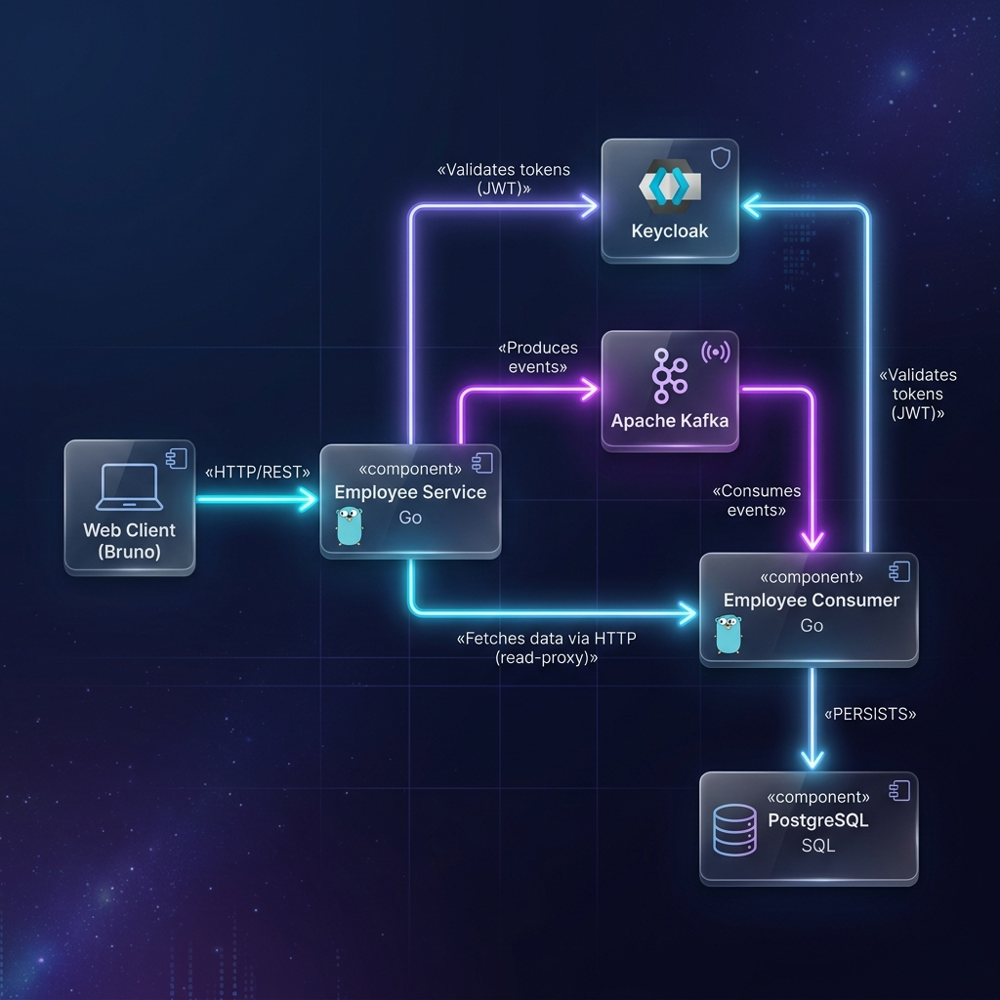
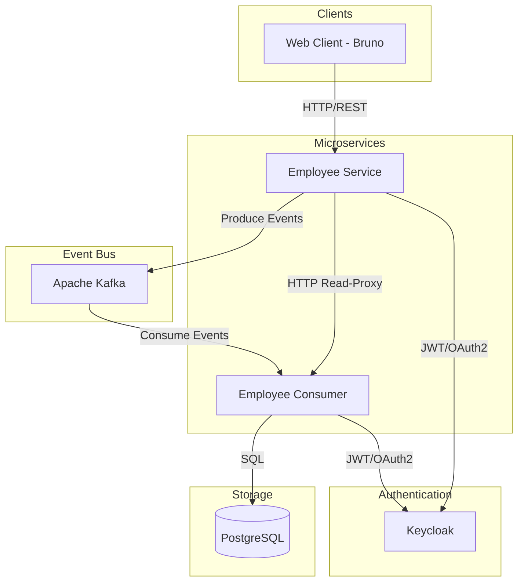
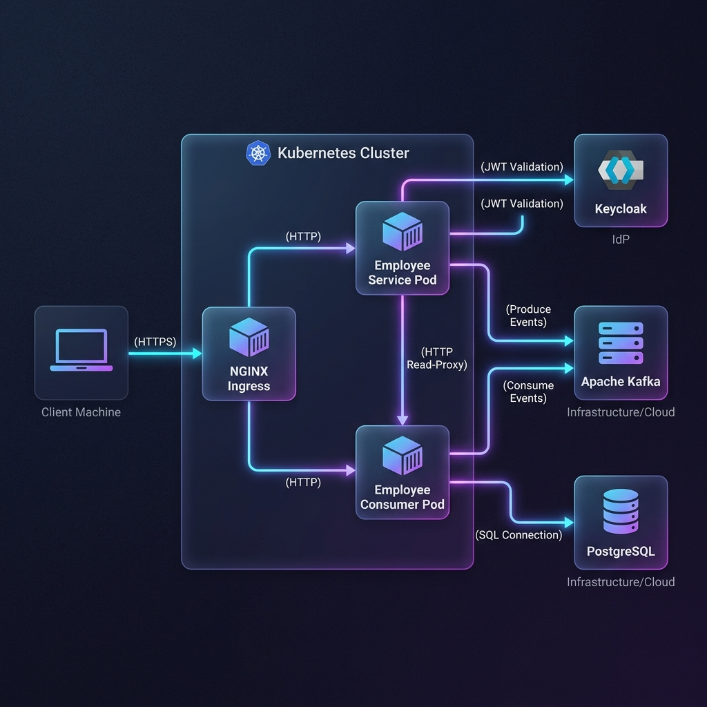
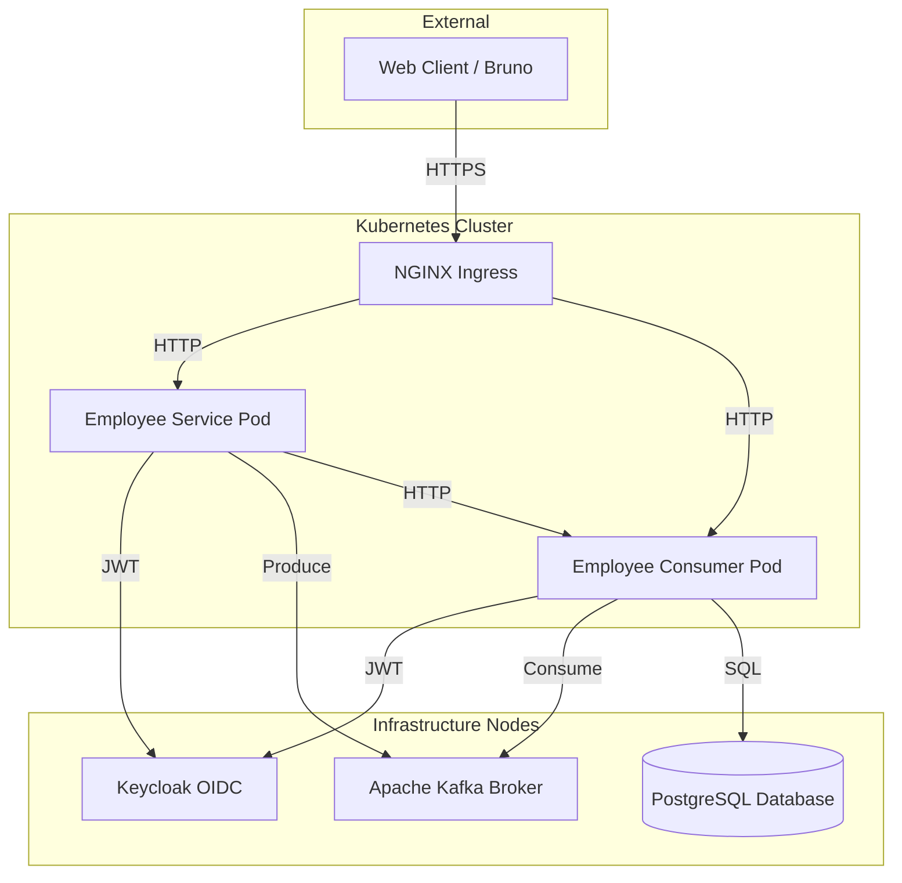
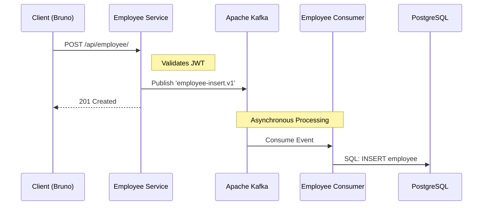
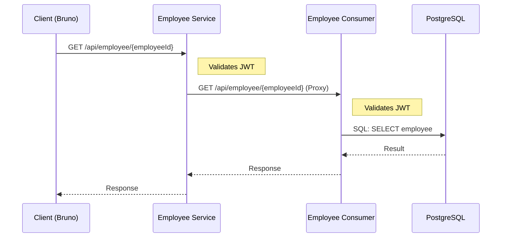
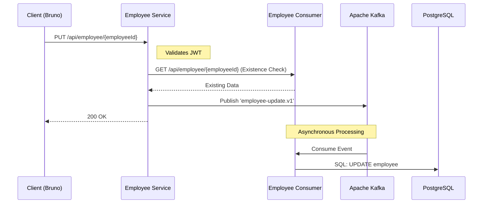
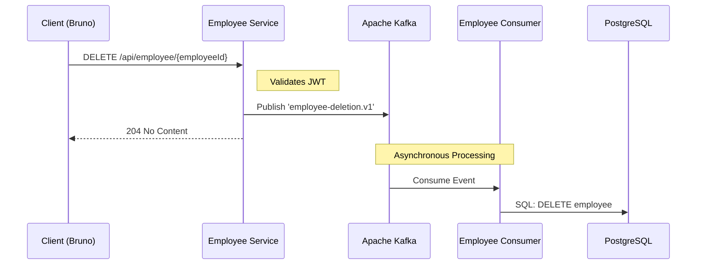

# GoEmployeeCrudEventDriven

Employee CRUD REST API using **Go** and **Event-Driven Architecture**.  
The project is split into two services that communicate over **Apache Kafka**:

| Service | Port | Description |
|---|---|---|
| `employee-service` | `8080` | REST API — CRUD operations, publishes Kafka events |
| `employee-consumer` | `8081` | Kafka consumer — processes events, stores/syncs data |

---

## Table of Contents

- [System Architecture](#system-architecture)
  - [Component Diagram (Mermaid)](#component-diagram-mermaid)
- [Deployment Architecture](#deployment-architecture)
  - [Infrastructure Diagram (Mermaid)](#infrastructure-diagram-mermaid)
- [Process Flows (Sequence Diagrams)](#process-flows-sequence-diagrams)
  - [1. Create Employee (Asynchronous)](#1-create-employee-asynchronous)
  - [2. Get Employee(s) (Distributed Read)](#2-get-employees-distributed-read)
  - [3. Update Employee (Hybrid Flow)](#3-update-employee-hybrid-flow)
  - [4. Delete Employee (Asynchronous)](#4-delete-employee-asynchronous)
- [Prerequisites](#prerequisites)
  - [1. Go 1.21+](#1-go-121)
  - [2. GCC / CGO (required by confluent-kafka-go)](#2-gcc--cgo-required-by-confluent-kafka-go)
  - [3. PostgreSQL](#3-postgresql)
  - [4. Apache Kafka](#4-apache-kafka)
  - [5. Environment Variables (optional .env file)](#5-environment-variables-optional-env-file)
- [Running Locally](#running-locally)
  - [Install dependencies](#install-dependencies-run-inside-each-service-directory)
  - [Run employee-service](#run-employee-service)
  - [Run employee-consumer](#run-employee-consumer)
- [Running with Docker Compose](#running-with-docker-compose)
- [Development Tasks (Makefile)](#development-tasks-makefile)
  - [Available Commands](#available-commands)
- [Running Tests](#running-tests)
- [Healthcheck](#healthcheck)
- [Swagger UI](#swagger-ui)
- [Testing via Kubernetes Ingress](#testing-via-kubernetes-ingress)
  - [employee-service (Producer / CRUD)](#employee-service-producer--crud)
  - [employee-consumer (Consumer / Read Replica)](#employee-consumer-consumer--read-replica)
- [Example Curls (Local Development)](#example-curls-local-development)
- [Project Structure](#project-structure)

---

## System Architecture



### Component Diagram (Mermaid)

> [View on Mermaid Live Editor](https://mermaid.live/edit#pako:eJx9kl9rwjAUxb9KydMGE2GPexjoLIy5MWcLPrQ-xOSqwTYp-SMr1u--26a1OqF5Sk5-9-TmJCfCFAfyEpCdpsU-iGepDHAYt_HCWyZAWuPVenghWcGmnQajYKqdVGvPgOSp_GcycXaPpGDUCiV7r1pP5lCyTNHDQP2XYFoZ0EfB4KqVyCtJmBeZKgE6YX3VrZLG5aB7plMGjktJeKwvNnUmJb3XnG4PNJkUlO3BLwY8Iqs03UFfPZsmDwtl7E5D9PP5eF_apTl6rd7jeDFehlFcdVfySLtomI9VPP6uA3yumhxbk_Z2A8i1SX1QsATKRwutfsvqUn-PIsAdzptoTOUD8FgzbaC2_ALd2t00hyFUGAp5CghKORUcf-GJ4EfJm__IqT6QM-66glMLIReYKG5saWYAZeqsikrJULLawQWcCYovkHfk-Q8YB-8E)




---

## Deployment Architecture



### Infrastructure Diagram (Mermaid)

> [View on Mermaid Live Editor](https://mermaid.live/edit#pako:eJx9kstOwzAQRX_F8gokKvYskGhTQSgqQYlUpISFE0_bKIkd-YGomv47Q9207gsvIs-d4_H4Zta0kBzoA6ELxdolSYJMEFza5k7I6PjHgBKszqhL_a1RXYIw6Qzy3Zbck6GyQn45BgTPxFmlic2xEhjQeMpqLOvXDMVCgdbp9DmcfvbR1yEfg_ouC4gkT8dNW8sVQK8RFD1yJIW2DagjtBc99nKXoZgrpo2yhbEKyBT90X6fEzavWPrUsmIJLsCnywqU10EwTG8iqQ2-If54IwEzLGcabj1kAquilqxK-w15D4PReWc7fweDx-4lSaK4661x6V2wz3eeT9cIzx-HuO_h4JZ9nSXdvsuLRKQktwV0zoWLyL8XevK1G0-RXXx05SmDjnf4B-gdoag2rOQ432tqltBsJ50zVdENZm3LmYExL41UmJizWgPKzBoZr0SBEk4B7MGgZDgjTU9ufgHXWAxi)



---

## Process Flows (Sequence Diagrams)

### 1. Create Employee (Asynchronous)

> [View on Mermaid Live Editor](https://mermaid.live/edit#pako:eNplkkFPwzAMhf+K1ctA2hjj2MOk0fUARWOQiV52Ca3XRmuT4iSVpmn/HZeuCNScIr9PL892zkFmcgxCCCx+edQZrpUsSNZ7DXwaSU5lqpHaQQTSQlQp5PvNI3ltbseQ6KC4bipzQgSB1KoMx1jSYatGZiVCIg9HOUbSf06R0dbXSGNu3XFbY11BKN5e9rpHotlyKULYvoodzGWj5ni1mvf6xjgEUkXpwByAyQ9ZqVw6tPCc7npGsEfCHv6zUraEyWAxU9oiubt2MRlAJqMQHe4XEBGyS94Lf94yLRIk0zSElT3prCSjjefkZDK0VumiZxN2YubaL8Qtj7tXUlbWIXCPITxtRPy+gyHQXgdTCHg8tVQ5L/McuBLrn7Xmko7BhVXfdN3FuXKGWDjIyiKXpXdGcB4uOfL4C16_wUBevgH7-7P9)



### 2. Get Employee(s) (Distributed Read)

> [View on Mermaid Live Editor](https://mermaid.live/edit#pako:eJyFkU1rwzAMhv-K8KmFldxz6GFJGCtldHNYLr2YRE3NEtvzx1gJ-e9T5mZspDAfjHj16LUsDazWDbIUmMP3gKrGXIrWiv6ogI4R1staGqE8ZCAcZJ1Eilf3Nii9XkJ8goredPqCCBzth6xxiVV_sEwrF3q0Sy6fuIN2vrXIn_dHFZFss93yFB6KEhJhZIJXp2SYo8dmjOiT9ghWtmcP-gRU9Co62QiPDnZVGRlOdtV_drA6WP15Wd-yrW7aVmSbp0B901Xsi6yE2S8C-SY-_IIudH4uin8jzdBYcO6Q1Oy3yu6A0ch6IRva3sD8GfvvPTbCvrGRssFM_RSN9NpS4iQ6hySL4DW_qJokbwP-gNe9z-T4BYkXr20)



### 3. Update Employee (Hybrid Flow)

> [View on Mermaid Live Editor](https://mermaid.live/edit#pako:eNp9kstugzAQRX9lxCaplDRplyyQUkBVS9WmIimbbFyYgBWwqR-oUZR/7xCgDyHVK8tzfH3nek5OKjN0XHA0flgUKQac5YpVOwG0aqYMT3nNhAEfmAa/5Ej76Z2yQl6NobiFwqou5RERYlQNT3GMJX8wXwptK1RjLmq5Vc3SAiFi+wMbI0GLrKU2ucL49WknOsSfe17swnq7gQWr+QL7xxanYfeQnTv0WRoExfPCgNwDXXpjJc+YQQ2PyaZjYpJLXLgP/5ODafjJtWlTBL/A9NAHlMw7M5cqFzkEzPSd/KhHZNa-l1wXMBk057ZufVw3N5MBJNJ34Xa5hJfot8SlCdmggmhGRlf6KNJCSSEtpaNkilrTyx0bdc30sUPY0JcOTj0vcIFydGG7DlabEAYvO-HMwKFfqhjPaGBOjimwuoxOxtTBOVO1sxtm3EhFhT0rNdIxs0bG5IeOjLL4DfajNpDnL/mQ0/8=)



### 4. Delete Employee (Asynchronous)

> [View on Mermaid Live Editor](https://mermaid.live/edit#pako:eNplkk1Pg0AQhv/KhIuatFaNJw5NKnBQGlNDI5dexmUKm8Iu7gdJ0/S/O0hpNOxpMu+z787HngKhCwpCCCx9e1KCYomlwWangE+LxkkhW1QOIkALUS2J49sX45W-m0JZDyVNW+sjEWRkOiloiqU9tmpRVAQp7g84RfJ/TpFW1jdkplzccxttXWko+1jv1IBE8+UyCyFO1sk2gQW2ckEXs8VpjF6L80C/a0dgZFk50Hvge59YywIdWXjLtwOTsWMawsZ/1dJWcDOazAuqyUmt7rvHmxFlNgrh6eGZrfviHU9t0P48qDsykM7yEFb2qERltNKemzFakLVSlQObshkzlxFA0l29clbiELjta6djVTsVzCDgiTUoC97vKXAVNb+bLtAcgjOrvu1bTArptGFhj7UlTqN3OuN6OOWMpyt4-Rkjef4B7Di7Dw==)



---

## Prerequisites

### 1. Go 1.21+
```bash
go version
```

### 2. GCC / CGO (required by confluent-kafka-go)
CGO must be enabled and a C compiler must be present.

```bash
# Enable CGO
go env -w CGO_ENABLED="1"

# Verify
go env CGO_ENABLED
```

**Install GCC:**
```bash
# Ubuntu / Debian
sudo apt-get install build-essential

# macOS
xcode-select --install
```

### 3. PostgreSQL
Each service connects to a PostgreSQL database. Default connection values:

| Variable | Default |
|---|---|
| `DB_HOST` | `localhost` |
| `DB_PORT` | `5432` (service) / `5433` (consumer) |
| `DB_NAME` | `employee_db` |
| `DB_USER` | `employee_user` |
| `DB_PASSWORD` | `employeepw` |
| `DB_DRIVER_NAME` | `postgres` |

The database schema is initialized automatically when using Docker Compose via `resources/init.sql`:

```sql
CREATE TABLE employees (
  id_employee       TEXT PRIMARY KEY,
  first_name        TEXT,
  last_name         TEXT,
  second_last_name  TEXT,
  date_of_birth     DATE,
  date_of_employment DATE,
  status            TEXT
);
```

### 4. Apache Kafka
Both services require a running Kafka broker.

| Variable | Default |
|---|---|
| `KAFKA_BOOTSTRAP_SERVERS` | `localhost:9092` |
| `KAFKA_CONSUMER_GROUP_ID` | `employee-group` (consumer only) |

### 5. Environment Variables (optional `.env` file)
Each service reads a `.env` file from its working directory if present.

```bash
# employee-service / employee-consumer
DB_HOST=localhost
DB_PORT=5432
DB_NAME=employee_db
DB_USER=employee_user
DB_PASSWORD=employeepw
DB_DRIVER_NAME=postgres
SERVER_PORT=8080
SERVER_HOST=0.0.0.0
OAUTH_ENABLED=false
SERVER_SSL_ENABLED=false
KAFKA_BOOTSTRAP_SERVERS=localhost:9092
KAFKA_CONSUMER_GROUP_ID=employee-group
```

---

## Running Locally

### Install dependencies (run inside each service directory)

```bash
cd employee-service && go mod tidy
cd employee-consumer && go mod tidy
```

### Run employee-service

```bash
cd employee-service

# directly
go run cmd/api-server/main.go

# or with make
make run
```

### Run employee-consumer

```bash
cd employee-consumer

# directly
go run cmd/api-server/main.go

# or with make
make run
```

---

## Running with Docker Compose

Each service has its own `docker-compose.yml` that starts the service together with PostgreSQL.

```bash
# employee-service
cd employee-service && make docker-compose-run

# employee-consumer
cd employee-consumer && make docker-compose-run
```

---

## Development Tasks (Makefile)

Each module (`employee-service` and `employee-consumer`) includes a `Makefile` to automate common development tasks.

### Available Commands

Run these commands from within the respective service directory.

| Command | Description |
|---|---|
| `make help` | Show all available targets and their descriptions |
| `make build` | Compile the service and generate a binary |
| `make run` | Build and run the service locally |
| `make test` | Run unit tests |
| `make test-cover` | Run unit tests and show coverage percentage |
| `make test-total-cover` | Generate a detailed coverage report |
| `make clean` | Remove build artifacts and binaries |
| `make docker-build` | Build the Docker image for the service |
| `make k8-apply` | Build and deploy the service to Kubernetes |

For a complete and up-to-date list, run:
```bash
make help
```

---

## Running Tests

```bash
# employee-service
cd employee-service && make test

# employee-consumer
cd employee-consumer && make test
```

---

## Healthcheck

```bash
# employee-service (port 8080)
curl -X GET http://localhost:8080/healthcheck/

# employee-consumer (port 8081)
curl -X GET http://localhost:8081/healthcheck/
```

---

## Swagger UI

```
http://localhost:8080/swagger/   # employee-service
http://localhost:8081/swagger/   # employee-consumer
```

To regenerate Swagger docs after changing annotations:
```bash
# Run from inside the service directory
swag init --dir cmd/api-server,internal
```
Making sure [go-swagger](https://github.com/go-swagger/go-swagger?tab=readme-ov-file#installing) is installed and [GOPATH](https://go.dev/wiki/SettingGOPATH#unix-systems) env is corrent. 

---

---

## Testing via Kubernetes Ingress

For testing when the project is running in Kubernetes via the NGINX Ingress Controller.

**Host Entry:** Ensure `127.0.0.1 api.employee.local` is added to your `/etc/hosts` file.

### employee-service (Producer / CRUD)

```bash
# Healthcheck
curl http://api.employee.local/employee-service/healthcheck/

# Get all employees
curl http://api.employee.local/employee-service/api/employee/

# Create employee
curl --request POST 'http://api.employee.local/employee-service/api/employee/' \
  --header 'Content-Type: application/json' \
  --data-raw '{
    "firstName": "Kubernetes",
    "lastName": "Test",
    "secondLastName": "User",
    "dateOfBirth": "2000-01-01T12:00:00Z",
    "dateOfEmployment": "2024-01-01T12:00:00Z",
    "status": "ACTIVE"
  }'
```

### employee-consumer (Consumer / Read Replica)

```bash
# Healthcheck
curl http://api.employee.local/employee-consumer/healthcheck/

# Get all employees (from read replica)
curl http://api.employee.local/employee-consumer/api/employee/
```

---

## Example Curls (Local Development)

```bash
# Get all employees
curl http://localhost:8080/api/employee/

# Get employee by ID
curl http://localhost:8080/api/employee/{employeeId}

# Create employee
curl --request POST 'http://localhost:8080/api/employee/' \
  --header 'Content-Type: application/json' \
  --data-raw '{
    "firstName": "Marcos",
    "lastName": "Luna",
    "secondLastName": "Valdez",
    "dateOfBirth": "1994-04-25T12:00:00Z",
    "dateOfEmployment": "1994-04-25T12:00:00Z",
    "status": "ACTIVE"
  }'

# Update employee
curl --request PUT 'http://localhost:8080/api/employee/{employeeId}' \
  --header 'Content-Type: application/json' \
  --data-raw '{
    "firstName": "Gerardo",
    "lastName": "Luna",
    "secondLastName": "Valdezz",
    "dateOfBirth": "1994-04-25T12:00:00Z",
    "dateOfEmployment": "0001-01-01T00:00:00Z",
    "status": "INACTIVE"
  }'

# Delete employee
curl --request DELETE 'http://localhost:8080/api/employee/{employeeId}'
```


## Project Structure

Both services follow the [Standard Go Project Layout](https://github.com/golang-standards/project-layout):

```
<service>/
├── cmd/api-server/   # Entry point (main.go)
├── internal/         # Private application code
│   ├── app/
│   ├── config/
│   ├── controllers/
│   ├── services/
│   ├── repositories/
│   ├── models/
│   ├── routes/
│   ├── dto/
│   └── constants/
├── pkg/utils/        # Public utility packages
├── docs/             # Swagger generated docs
├── resources/        # SQL init scripts, SSL certs
└── Makefile
```

See [PROJECT_STRUCTURE.md](./PROJECT_STRUCTURE.md) for more details.
